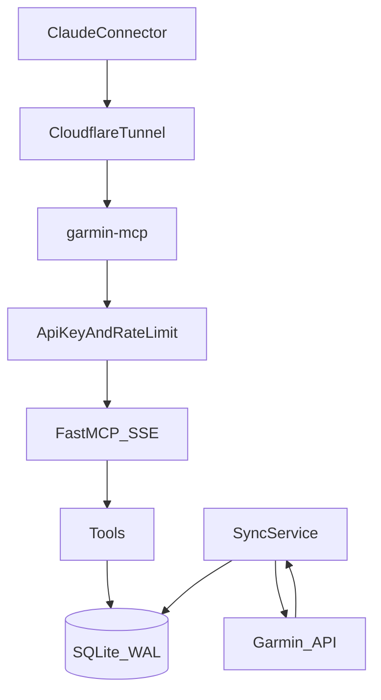

# Garmin MCP Server

Self-hosted **Model Context Protocol** server for Garmin Connect: multi-user, SQLite-backed history, HTTP/SSE for Claude custom connectors, optional Cloudflare Tunnel, and an agentic “sports companion” layer (bootstrap context, workout prompt, goals, flags).

## Architecture



## Prerequisites

- Docker and Docker Compose
- Garmin account (see **Garmin MFA** below)
- Cloudflare account if using Tunnel

## Quick start

1. **Clone** this repository.
2. **Copy** `config.example.yaml` to `config.yaml` and fill in credentials, API keys, encryption secrets, and paths.
3. **Set** `TUNNEL_TOKEN` in the environment (e.g. `.env` next to `docker-compose.yml`) if using Cloudflare Tunnel.
4. **Run** `docker compose up -d` (or `make up`).
5. **Open** Claude → Settings → Connectors → Add custom connector: base URL `https://<your-tunnel-host>/mcp` (or your public URL), header `X-API-Key: <user api_key>`.

## Configuration reference

| Field | Type | Default | Description |
| --- | --- | --- | --- |
| `port` | int | `8765` | HTTP port |
| `log_level` | string | `info` | Logging level |
| `sync_interval_minutes` | int | `30` | Background sync interval |
| `max_date_range_days` | int | `90` | Max date span for tools |
| `users[].name` | string | — | Username (must match `/sync/{username}`) |
| `users[].api_key` | string | — | Secret for `X-API-Key` |
| `users[].db_path` | path | — | SQLite file |
| `users[].backup_path` | path | — | Backup directory (default example uses `/data/backups/{name}/` outside the repo) |
| `users[].timezone` | string | — | IANA timezone for display |
| `users[].rate_limit` | int | `30` | Requests per minute per user |
| `users[].initial_sync_days` | int | `365` | First full history pull |
| `users[].flag_rules` | object | — | Thresholds for proactive flags |

## Multi-user setup

Each `users[]` entry is isolated: its own Garmin credentials, API key, encrypted token file, SQLite DB, and backups.

## Garmin MFA / Two-Factor Authentication

Garmin must have **MFA disabled** for automated login. Configure your account at:

https://account.garmin.com/account/security/

## Rotating an API Key

1. Edit `config.yaml` and update the `api_key` value for the relevant user.
2. Run `make down && make up` to restart the container.
3. Update the `X-API-Key` header value in the Claude custom connector settings for that user.
4. Verify with `make logs` that the server restarted cleanly.

## Sports companion: custom instructions

Add this to Claude’s **custom instructions** so every session bootstraps fresh data:

```
You are my personal sports coach with access to my Garmin data.
At the start of every conversation, call get_my_context to load
my current goals, recent training history, and latest data before
responding to anything.
```

## MCP prompt: `analyze_new_workout`

Registered as a named prompt. Use when the user asks to analyze the latest workout or last run; it follows the structured steps documented in the server (context → activities → detail → reasoning → suggest → feeling).

## Makefile

| Target | Purpose |
| --- | --- |
| `make up` | `docker compose up -d` |
| `make down` | `docker compose down` |
| `make logs` | Follow logs |
| `make test` | Pytest suite |
| `make lint` | Ruff |
| `make sync` | `scripts/sync_all.py` — POST `/sync/{user}` for each user (**server must be running**) |
| `make backup` | POST `/backup/all` (set `GARMIN_API_KEY` to any user’s key) |
| `make shell` | Shell in `garmin-mcp` container |
| `make validate` | Compose config + config schema load |

## Running tests

```bash
python -m venv .venv && .venv/bin/pip install -r requirements.txt
pytest tests/ -v
```

## Troubleshooting

- **Token expiry / auth errors**: Check Garmin credentials; delete encrypted token file and restart; see logs.
- **Port conflicts**: Change `port` in `config.yaml` and compose port mapping.
- **Tunnel not connecting**: Verify `TUNNEL_TOKEN` and Cloudflare route to `http://garmin-mcp:8765`.
- **`make sync` fails**: The server must be reachable at `http://127.0.0.1:8765` (or set `GARMIN_MCP_URL`). Start with `make up` first.
- **Backups in repo**: Prefer `backup_path` under `/data/...` (Docker volume). If you store backups inside the repo, extend `.gitignore` accordingly.

## License

See [LICENSE](LICENSE).
