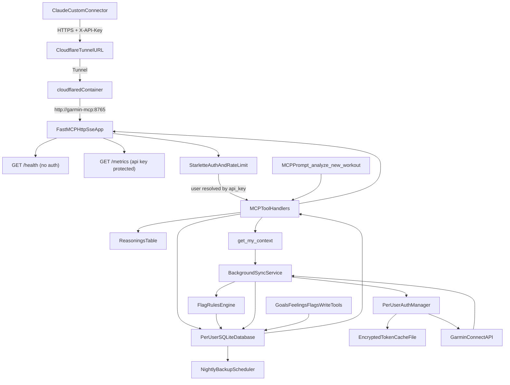

## Archived snapshot

**Date:** 2026-04-16. This file is an immutable copy of the agreed build specification (no implied runtime behavior change).

# Build Self-Hosted Garmin MCP Server

## Scope
Implement a greenfield project that matches the requested structure and behavior:
- FastMCP server in explicit HTTP/SSE mode (internet-reachable via Cloudflare Tunnel)
- Multi-user isolation keyed by `X-API-Key` (each key maps to one Garmin account/session/cache)
- Starlette middleware auth gate (401 before any tool execution), with `/health` bypass
- Per-user Garmin token cache encrypted at rest with robust expiry/error recovery (single retry then clean fail)
- SQLite-backed local data model per user; MCP tools query DB only (no direct Garmin calls on tool execution)
- Startup delta sync + scheduled sync + on-demand sync endpoints to refresh local cache from Garmin
- Versioned archival model (no hard deletes), plus goals and Claude reasoning write-back workflow
- Docker + docker-compose with `garmin-mcp` and `cloudflared`, fixed app port `8765`
- Structured logging, Prometheus metrics, graceful shutdown, and startup readiness checks
- Full automated tests (unit + e2e, no real Garmin creds required), plus CI/lint/tooling
- Open-source-grade docs: `README.md`, `context.md`, `CONTRIBUTING.md`, and release files
- **Agentic sports companion layer**: bootstrap tool `get_my_context` (triggers silent delta sync then returns aggregated state), named MCP prompt `analyze_new_workout`, read tools `suggest_next_workout` and `get_goal_progress`, write tools `log_workout_feeling` and `dismiss_flag`, proactive **flags** evaluated during each sync with per-user configurable thresholds

## Implementation Plan

1. **Scaffold expanded project and release assets**
   - Create all requested files under:
     - [`/Users/aaa/Desktop/Folder/Projects/garmin-mcp/.github/workflows/ci.yml`](/Users/aaa/Desktop/Folder/Projects/garmin-mcp/.github/workflows/ci.yml)
     - [`/Users/aaa/Desktop/Folder/Projects/garmin-mcp/github_issues/issue_tunnel_isolation.md`](/Users/aaa/Desktop/Folder/Projects/garmin-mcp/github_issues/issue_tunnel_isolation.md)
     - [`/Users/aaa/Desktop/Folder/Projects/garmin-mcp/github_issues/issue_template.md`](/Users/aaa/Desktop/Folder/Projects/garmin-mcp/github_issues/issue_template.md)
     - [`/Users/aaa/Desktop/Folder/Projects/garmin-mcp/Dockerfile`](/Users/aaa/Desktop/Folder/Projects/garmin-mcp/Dockerfile)
     - [`/Users/aaa/Desktop/Folder/Projects/garmin-mcp/docker-compose.yml`](/Users/aaa/Desktop/Folder/Projects/garmin-mcp/docker-compose.yml)
     - [`/Users/aaa/Desktop/Folder/Projects/garmin-mcp/config.example.yaml`](/Users/aaa/Desktop/Folder/Projects/garmin-mcp/config.example.yaml)
     - [`/Users/aaa/Desktop/Folder/Projects/garmin-mcp/context.md`](/Users/aaa/Desktop/Folder/Projects/garmin-mcp/context.md)
     - [`/Users/aaa/Desktop/Folder/Projects/garmin-mcp/CHANGELOG.md`](/Users/aaa/Desktop/Folder/Projects/garmin-mcp/CHANGELOG.md)
     - [`/Users/aaa/Desktop/Folder/Projects/garmin-mcp/CONTRIBUTING.md`](/Users/aaa/Desktop/Folder/Projects/garmin-mcp/CONTRIBUTING.md)
     - [`/Users/aaa/Desktop/Folder/Projects/garmin-mcp/VERSION`](/Users/aaa/Desktop/Folder/Projects/garmin-mcp/VERSION)
     - [`/Users/aaa/Desktop/Folder/Projects/garmin-mcp/Makefile`](/Users/aaa/Desktop/Folder/Projects/garmin-mcp/Makefile)
     - [`/Users/aaa/Desktop/Folder/Projects/garmin-mcp/.gitignore`](/Users/aaa/Desktop/Folder/Projects/garmin-mcp/.gitignore)
     - [`/Users/aaa/Desktop/Folder/Projects/garmin-mcp/requirements.txt`](/Users/aaa/Desktop/Folder/Projects/garmin-mcp/requirements.txt)
     - [`/Users/aaa/Desktop/Folder/Projects/garmin-mcp/README.md`](/Users/aaa/Desktop/Folder/Projects/garmin-mcp/README.md)
     - [`/Users/aaa/Desktop/Folder/Projects/garmin-mcp/src/main.py`](/Users/aaa/Desktop/Folder/Projects/garmin-mcp/src/main.py)
     - [`/Users/aaa/Desktop/Folder/Projects/garmin-mcp/src/config.py`](/Users/aaa/Desktop/Folder/Projects/garmin-mcp/src/config.py)
     - [`/Users/aaa/Desktop/Folder/Projects/garmin-mcp/src/auth.py`](/Users/aaa/Desktop/Folder/Projects/garmin-mcp/src/auth.py)
     - [`/Users/aaa/Desktop/Folder/Projects/garmin-mcp/src/middleware.py`](/Users/aaa/Desktop/Folder/Projects/garmin-mcp/src/middleware.py)
     - [`/Users/aaa/Desktop/Folder/Projects/garmin-mcp/src/sync.py`](/Users/aaa/Desktop/Folder/Projects/garmin-mcp/src/sync.py)
     - [`/Users/aaa/Desktop/Folder/Projects/garmin-mcp/src/database.py`](/Users/aaa/Desktop/Folder/Projects/garmin-mcp/src/database.py)
     - [`/Users/aaa/Desktop/Folder/Projects/garmin-mcp/src/tools/context.py`](/Users/aaa/Desktop/Folder/Projects/garmin-mcp/src/tools/context.py)
     - [`/Users/aaa/Desktop/Folder/Projects/garmin-mcp/src/tools/activities.py`](/Users/aaa/Desktop/Folder/Projects/garmin-mcp/src/tools/activities.py)
     - [`/Users/aaa/Desktop/Folder/Projects/garmin-mcp/src/tools/sleep.py`](/Users/aaa/Desktop/Folder/Projects/garmin-mcp/src/tools/sleep.py)
     - [`/Users/aaa/Desktop/Folder/Projects/garmin-mcp/src/tools/training.py`](/Users/aaa/Desktop/Folder/Projects/garmin-mcp/src/tools/training.py)
     - [`/Users/aaa/Desktop/Folder/Projects/garmin-mcp/src/tools/feelings.py`](/Users/aaa/Desktop/Folder/Projects/garmin-mcp/src/tools/feelings.py)
     - [`/Users/aaa/Desktop/Folder/Projects/garmin-mcp/src/tools/flags.py`](/Users/aaa/Desktop/Folder/Projects/garmin-mcp/src/tools/flags.py)
     - [`/Users/aaa/Desktop/Folder/Projects/garmin-mcp/src/tools/history.py`](/Users/aaa/Desktop/Folder/Projects/garmin-mcp/src/tools/history.py)
     - [`/Users/aaa/Desktop/Folder/Projects/garmin-mcp/src/tools/goals.py`](/Users/aaa/Desktop/Folder/Projects/garmin-mcp/src/tools/goals.py)
     - [`/Users/aaa/Desktop/Folder/Projects/garmin-mcp/tests/unit/test_config.py`](/Users/aaa/Desktop/Folder/Projects/garmin-mcp/tests/unit/test_config.py)
     - [`/Users/aaa/Desktop/Folder/Projects/garmin-mcp/tests/unit/test_auth.py`](/Users/aaa/Desktop/Folder/Projects/garmin-mcp/tests/unit/test_auth.py)
     - [`/Users/aaa/Desktop/Folder/Projects/garmin-mcp/tests/unit/test_middleware.py`](/Users/aaa/Desktop/Folder/Projects/garmin-mcp/tests/unit/test_middleware.py)
     - [`/Users/aaa/Desktop/Folder/Projects/garmin-mcp/tests/unit/test_sync.py`](/Users/aaa/Desktop/Folder/Projects/garmin-mcp/tests/unit/test_sync.py)
     - [`/Users/aaa/Desktop/Folder/Projects/garmin-mcp/tests/unit/test_database.py`](/Users/aaa/Desktop/Folder/Projects/garmin-mcp/tests/unit/test_database.py)
     - [`/Users/aaa/Desktop/Folder/Projects/garmin-mcp/tests/unit/test_backup.py`](/Users/aaa/Desktop/Folder/Projects/garmin-mcp/tests/unit/test_backup.py) (see step 12 for explicit cases)
     - [`/Users/aaa/Desktop/Folder/Projects/garmin-mcp/tests/unit/tools/test_activities.py`](/Users/aaa/Desktop/Folder/Projects/garmin-mcp/tests/unit/tools/test_activities.py)
     - [`/Users/aaa/Desktop/Folder/Projects/garmin-mcp/tests/unit/tools/test_sleep.py`](/Users/aaa/Desktop/Folder/Projects/garmin-mcp/tests/unit/tools/test_sleep.py)
     - [`/Users/aaa/Desktop/Folder/Projects/garmin-mcp/tests/unit/tools/test_training.py`](/Users/aaa/Desktop/Folder/Projects/garmin-mcp/tests/unit/tools/test_training.py)
     - [`/Users/aaa/Desktop/Folder/Projects/garmin-mcp/tests/unit/tools/test_context.py`](/Users/aaa/Desktop/Folder/Projects/garmin-mcp/tests/unit/tools/test_context.py)
     - [`/Users/aaa/Desktop/Folder/Projects/garmin-mcp/tests/unit/tools/test_feelings.py`](/Users/aaa/Desktop/Folder/Projects/garmin-mcp/tests/unit/tools/test_feelings.py)
     - [`/Users/aaa/Desktop/Folder/Projects/garmin-mcp/tests/unit/test_flags.py`](/Users/aaa/Desktop/Folder/Projects/garmin-mcp/tests/unit/test_flags.py) (flag rule boundary tests + `dismiss_flag` tool tests as appropriate)
     - [`/Users/aaa/Desktop/Folder/Projects/garmin-mcp/tests/unit/tools/test_history.py`](/Users/aaa/Desktop/Folder/Projects/garmin-mcp/tests/unit/tools/test_history.py)
     - [`/Users/aaa/Desktop/Folder/Projects/garmin-mcp/tests/unit/tools/test_goals.py`](/Users/aaa/Desktop/Folder/Projects/garmin-mcp/tests/unit/tools/test_goals.py) — `create_goal`, `complete_goal`, `list_goals`, `archive_goal`, `log_reasoning`, `get_goal_progress`: creation and retrieval; **complete** archives linked reasonings; **archive** archives linked reasonings; `list_goals` only **active** by default; `get_goal_progress` statuses (**on_track** / **at_risk** / **behind** / **achieved**) from mocked trend data; `log_reasoning` with and without `goal_id`.
     - [`/Users/aaa/Desktop/Folder/Projects/garmin-mcp/tests/e2e/test_server.py`](/Users/aaa/Desktop/Folder/Projects/garmin-mcp/tests/e2e/test_server.py)
     - Optional: [`/Users/aaa/Desktop/Folder/Projects/garmin-mcp/scripts/sync_all.py`](/Users/aaa/Desktop/Folder/Projects/garmin-mcp/scripts/sync_all.py) — invoked by `make sync` to loop users and call `POST /sync/{username}` (see step 13).
   - Pin exact dependency versions in `requirements.txt` and annotate verification date comment.

2. **Redesign config contract for multi-user + sync + safety**
   - In [`/Users/aaa/Desktop/Folder/Projects/garmin-mcp/src/config.py`](/Users/aaa/Desktop/Folder/Projects/garmin-mcp/src/config.py), create Pydantic models for:
     - `users: []` list with `name`, `garmin_email`, `garmin_password`, `api_key`, `token_cache_path`, `encryption_secret`, `timezone`, `rate_limit`, `db_path`, `backup_path`, `backup_retention`, `initial_sync_days`, `reasoning_retention_days`, `goals`, and nested **`flag_rules`** (or equivalent) for thresholds: poor-sleep streak days, load week-over-week %, idle days before goal deadline, PR detection toggles, etc.
     - Global server config including `port` (default and runtime set to `8765`)
     - `cloudflare_tunnel_token`
     - `log_level` (default `info`)
     - Tool enable/disable flags
     - Default date range (`last_n_days`), max query range (`max_date_range_days`), sync interval (`sync_interval_minutes`), nightly backup time
   - Enforce validation: missing fields, wrong types, duplicate API keys/user names, invalid timezones, invalid ranges/counts.
   - Add [`/Users/aaa/Desktop/Folder/Projects/garmin-mcp/config.example.yaml`](/Users/aaa/Desktop/Folder/Projects/garmin-mcp/config.example.yaml) with two example users, timezone notes, encryption guidance, and sync/rate-limit settings.
   - **Default `backup_path` in example**: `/data/backups/{name}/` (Docker volume path, outside git working tree) so backups are safe by default; README notes that if `backup_path` is under the project directory the user must align with `.gitignore` patterns.
   - Include documented per-user block aligned to requested structure:
     - `name`, `garmin_email`, `garmin_password`, `api_key`, `token_cache_path`, `db_path`, `backup_path`, `backup_retention`, `timezone`, `rate_limit`, `initial_sync_days`, `reasoning_retention_days`, `goals`.

3. **Implement database layer (per-user SQLite)**
   - In [`/Users/aaa/Desktop/Folder/Projects/garmin-mcp/src/database.py`](/Users/aaa/Desktop/Folder/Projects/garmin-mcp/src/database.py):
     - On **every new** per-user connection, run **`PRAGMA journal_mode=WAL;` as the first statement** before any read or write (connection factory / `connect` wrapper). Document concurrency rationale in [`context.md`](/Users/aaa/Desktop/Folder/Projects/garmin-mcp/context.md) under **Concurrency model** (sync writes + tool reads concurrently; WAL avoids lock errors; SQLite OK for personal/family scale; beyond ~10 users consider PostgreSQL).
     - Initialize per-user SQLite database connections and schema migrations.
     - Tables: `activities`, `sleep`, `training_status`, `training_readiness`, `sync_log`, `reasonings`, `goals`, **`flags`**, **`workout_feelings`**.
     - Store both raw Garmin payload blobs and normalized fields used by MCP tools.
     - Add `status`, `archived_at`, and `version` columns where applicable; no hard deletes.
     - Add helpers for upserts, query filtering by date/user, reasonings writes, and last-sync lookups.
     - Add archival/versioning helpers so missing entries in new sync responses are marked archived.
     - Add backup helpers (export copy, retention pruning) and reasoning retention pruning for untagged entries.
     - Ensure safe startup/teardown behavior to reduce corruption risk.

4. **Implement sync service as the only Garmin API caller**
   - In [`/Users/aaa/Desktop/Folder/Projects/garmin-mcp/src/sync.py`](/Users/aaa/Desktop/Folder/Projects/garmin-mcp/src/sync.py):
     - Startup sync policy:
       - If `last_sync_at` exists -> delta sync from last timestamp.
       - If no `last_sync_at` -> first-boot pull limited by per-user `initial_sync_days` (default 365).
     - Background scheduler polling Garmin at configured interval.
     - On-demand sync endpoint `POST /sync/{username}`: after middleware resolves user from `X-API-Key`, **require** `resolved_user.name == {username}` (or canonical username match per config). If the key is valid but belongs to **another** user → **403 Forbidden** with a clear message (not 401). E2E: user A’s key calling `POST /sync/B` returns 403.
     - Write sync outcomes to `sync_log` and update domain tables.
     - Log sync duration + record counts per user on each sync.
     - After each successful sync, run **flag evaluation** for that user (rules from config + DB state): e.g. `recovery_risk`, `overtraining_risk`, `goal_at_risk`, `pr_achieved`; insert/update rows in `flags` with `acknowledged` false by default.
     - Expose a **synchronous sync entry point** (same code path as delta sync) callable from `get_my_context` so Claude gets fresh DB state without relying on background scheduler alone.
     - Guarantee ordinary read tools never call Garmin APIs directly; **exception**: `get_my_context` orchestrates one silent delta sync via sync layer before aggregating DB reads.

5. **Build HTTP/SSE server and lifecycle management**
   - In [`/Users/aaa/Desktop/Folder/Projects/garmin-mcp/src/main.py`](/Users/aaa/Desktop/Folder/Projects/garmin-mcp/src/main.py):
     - Explicitly run FastMCP in HTTP/SSE transport mode (not stdio).
     - Mount/wrap with Starlette so middleware can guard all MCP routes.
     - Expose `GET /health` returning `{\"status\":\"ok\"}` and bypass auth checks.
     - Add `version` field in `/health` response from [`/Users/aaa/Desktop/Folder/Projects/garmin-mcp/VERSION`](/Users/aaa/Desktop/Folder/Projects/garmin-mcp/VERSION).
     - Expose protected `GET /metrics` (Prometheus text format).
     - Bind to configured port (`8765` unless changed in config).
     - On startup, perform per-user readiness check (config/token/db), log ready/failed per user, continue serving healthy users.
     - Handle SIGINT/SIGTERM graceful shutdown: stop intake, await in-flight work, flush DB writes, close sessions.
     - Initialize structured logging and startup messages.
     - Register **MCP prompt resource** `analyze_new_workout` with the structured post-workout analysis flow (see companion layer section) so clients can surface it as a named prompt / slash-style suggestion.

6. **Implement auth + encrypted token cache**
   - In [`/Users/aaa/Desktop/Folder/Projects/garmin-mcp/src/auth.py`](/Users/aaa/Desktop/Folder/Projects/garmin-mcp/src/auth.py):
     - Manage isolated Garmin sessions per user.
     - Encrypt token cache at rest with Fernet using per-user `encryption_secret`.
     - Load/decrypt/reuse cached tokens; refresh as needed.
     - On `GarminConnectAuthenticationError` or malformed/unexpected auth responses: invalidate cache and retry exactly once, then raise clean failure.
     - Ensure token writes are atomic and never plaintext.

7. **Implement Starlette middleware for auth + rate limiting**
   - In [`/Users/aaa/Desktop/Folder/Projects/garmin-mcp/src/middleware.py`](/Users/aaa/Desktop/Folder/Projects/garmin-mcp/src/middleware.py):
     - Validate `X-API-Key` for all non-health routes.
     - Resolve the calling user by API key and attach user context to request scope/state.
     - Enforce per-user requests-per-minute limits from config.
     - Return clear `429` structured response on rate-limit breaches.
     - Return 401 for missing/invalid keys before request reaches any tool.
     - Ensure no credential or token secrets are ever logged.

8. **Build DB-backed tool modules + agentic companion layer**
   - Split tools across modules per updated layout; each tool respects per-tool toggles and resolved user context.
   - **Bootstrap / context** — [`/Users/aaa/Desktop/Folder/Projects/garmin-mcp/src/tools/context.py`](/Users/aaa/Desktop/Folder/Projects/garmin-mcp/src/tools/context.py)
     - `get_my_context`: **before** aggregating, invoke sync layer’s **silent delta sync** for this user; then return from DB only: active goals + progress summary, last 7 days non-archived reasonings, current training status + readiness, last sync timestamp, **unacknowledged flags** (e.g. recovery/overtraining/goal/PR). Response includes provenance (`data_source` / `last_sync_at` as elsewhere).
   - **Activities** — [`activities.py`](/Users/aaa/Desktop/Folder/Projects/garmin-mcp/src/tools/activities.py): `get_recent_activities`, `get_activity_detail` (DB-only; optional query of archived rows when explicitly requested).
   - **Sleep** — [`sleep.py`](/Users/aaa/Desktop/Folder/Projects/garmin-mcp/src/tools/sleep.py): `get_sleep`.
   - **Training** — [`training.py`](/Users/aaa/Desktop/Folder/Projects/garmin-mcp/src/tools/training.py): `get_training_status`, `get_training_readiness`, **`suggest_next_workout`** (read-only; never raises on sparse DB; always returns valid structured fields + **`data_quality`**: `full` | `partial` | `sparse`):
     - Missing/stale readiness → assume **moderate** readiness, note assumption in response.
     - No recent activities → suggest **light baseline** workout, note sparse data.
     - No active goals → suggest from **training load only**, note no goal set.
     - All inputs missing/degenerate → still return a safe baseline suggestion, **`data_quality: sparse`**, never unhandled exceptions.
   - **Goals + reasoning writes** — [`goals.py`](/Users/aaa/Desktop/Folder/Projects/garmin-mcp/src/tools/goals.py): `create_goal`, `complete_goal`, `list_goals`, `archive_goal`, `log_reasoning`, **`get_goal_progress`** (per active goal: target, current measured value from DB, delta to target, estimated completion from trend, workout count since goal created, status `on_track` | `at_risk` | `behind` | `achieved`).
   - **Feelings** — [`feelings.py`](/Users/aaa/Desktop/Folder/Projects/garmin-mcp/src/tools/feelings.py): **`log_workout_feeling`** (`activity_id`, `feeling` text, `energy_level` enum, `notes`) → `workout_feelings` table; surfaced in later context/reasoning.
   - **Flags** — [`flags.py`](/Users/aaa/Desktop/Folder/Projects/garmin-mcp/src/tools/flags.py): **`dismiss_flag`** (acknowledge after Claude surfaces; stops repeat in `get_my_context`).
   - **History** — [`history.py`](/Users/aaa/Desktop/Folder/Projects/garmin-mcp/src/tools/history.py): `get_historical_summary` (reasoning queries; respects archival).
   - **MCP prompt** — register **`analyze_new_workout`** (built-in prompt resource) documenting the flow: call `get_my_context` if not yet; `get_recent_activities` limit 1; `get_activity_detail`; compare to goal metric and 4-week trend; cross-reference sleep + readiness; flag anomalies; `log_reasoning` with goal tag; `suggest_next_workout`; prompt user for feeling → `log_workout_feeling`.
   - Ordinary read tools query SQLite only (no Garmin). **`get_my_context`** is the documented exception: it **calls the sync service** once per invocation for fresh data, then reads DB.
   - Validate all inputs before query: ISO date formats, max range, no nonsensical future dates, positive counts/IDs.
   - Convert response timestamps to user timezone via `zoneinfo`.
   - Add provenance metadata in tool responses: `data_source` and `last_sync_at`.
   - Optional: log tool call + params + normalized response to `reasonings` where applicable; **`log_reasoning`** remains the explicit write-back for Claude observations.
   - Enforce lifecycle rules:
     - `list_goals` returns active goals by default.
     - Completing/archiving a goal archives linked reasonings.
     - Archived data hidden unless explicitly requested.
     - Untagged reasonings pruned after `reasoning_retention_days`.

9. **Add observability and metrics**
   - Structured logs include timestamp, level, and user context where available.
   - Track Prometheus counters per user: tool calls, DB hits, sync calls (including **syncs triggered by `get_my_context`**), auth refreshes, rate-limit hits, flag creations/dismissals, errors.
   - Keep secrets redacted from logs and metrics labels.

10. **Containerize app and tunnel service with pinned versions**
   - Add [`/Users/aaa/Desktop/Folder/Projects/garmin-mcp/Dockerfile`](/Users/aaa/Desktop/Folder/Projects/garmin-mcp/Dockerfile) using `python:3.12-slim`.
   - Pin Docker base image (e.g., `python:3.12.3-slim`) and comment verification date.
   - Add [`/Users/aaa/Desktop/Folder/Projects/garmin-mcp/docker-compose.yml`](/Users/aaa/Desktop/Folder/Projects/garmin-mcp/docker-compose.yml) with:
     - `garmin-mcp` service on `8765:8765`
     - `cloudflared` service running tunnel
     - Explicit tunnel target to `http://garmin-mcp:8765`
     - `TUNNEL_TOKEN` environment variable wired from `config.yaml` value during run workflow
     - Docker healthcheck hitting `/health`
     - Pinned `cloudflared` image tag with verification comment
     - Named volume(s) for token cache persistence across restarts

11. **Secure defaults and repository hygiene**
   - Add [`/Users/aaa/Desktop/Folder/Projects/garmin-mcp/.gitignore`](/Users/aaa/Desktop/Folder/Projects/garmin-mcp/.gitignore) entries for:
     - `config.yaml`
     - per-user token cache files/directories
     - per-user SQLite DB files
     - **Backup directories**: comment explaining configurable paths + pattern(s) (e.g. `data/backups/` or `**/backups/` as appropriate); README states that if `backup_path` is **inside** the repo, users must match `.gitignore` or relocate to e.g. `/data/...` volume path.
     - Python cache/build artifacts
   - Keep all secrets exclusively in local config/runtime env; never hardcode credentials.

12. **Implement automated tests**
   - Unit tests under [`/Users/aaa/Desktop/Folder/Projects/garmin-mcp/tests/unit/`](/Users/aaa/Desktop/Folder/Projects/garmin-mcp/tests/unit/) for:
     - Config validation: valid config, missing fields, invalid types
     - Middleware: valid key, wrong key, missing key, rate limit, `/health` bypass
     - Auth manager: encrypted cache, token reuse, expiry/error invalidation + one retry, terminal failure
     - Database helpers and sync orchestration
     - [`test_backup.py`](/Users/aaa/Desktop/Folder/Projects/garmin-mcp/tests/unit/test_backup.py) — explicit cases:
       - Nightly backup job creates a file under each user’s configured `backup_path`
       - Retention: when backup file count exceeds `backup_retention`, **oldest** removed, newer retained
       - On-demand backup (`make backup` / equivalent trigger): runs immediately for **all** users, completion logged
       - Unwritable `backup_path`: log clear error, **no** server crash, **no** source DB corruption
       - Backup filenames include a **timestamp** so multiple per-user backups are distinguishable
     - Tool modules: [`test_context.py`](/Users/aaa/Desktop/Folder/Projects/garmin-mcp/tests/unit/tools/test_context.py) (sync-then-read), [`test_feelings.py`](/Users/aaa/Desktop/Folder/Projects/garmin-mcp/tests/unit/tools/test_feelings.py), payload shape mapping, timezone conversion, validation failures, history; goal/reasoning in [`test_goals.py`](/Users/aaa/Desktop/Folder/Projects/garmin-mcp/tests/unit/tools/test_goals.py) (see scaffold list for coverage)
     - **Flag rule boundary tests** (mocked DB state) in [`tests/unit/test_flags.py`](/Users/aaa/Desktop/Folder/Projects/garmin-mcp/tests/unit/test_flags.py) (primary) with optional overlap in [`test_sync.py`](/Users/aaa/Desktop/Folder/Projects/garmin-mcp/tests/unit/test_sync.py): per rule, assert flag written or not at threshold / ±1:
       - `recovery_risk`: poor-sleep streak exactly 3 vs 2 vs 4 days
       - `overtraining_risk`: load WoW exactly 10% vs just under vs just over
       - `goal_at_risk`: idle days at deadline threshold vs before vs after
       - `pr_achieved`: PR detected vs no PR
     - **`suggest_next_workout`** in [`tests/unit/tools/test_training.py`](/Users/aaa/Desktop/Folder/Projects/garmin-mcp/tests/unit/tools/test_training.py): all data present → `data_quality: full`; missing readiness → `partial` + assumption note; no activities → `sparse` + baseline; no goals → `partial` + load-only; all missing → valid response, `sparse`, no uncaught exception.
   - E2E tests under [`/Users/aaa/Desktop/Folder/Projects/garmin-mcp/tests/e2e/test_server.py`](/Users/aaa/Desktop/Folder/Projects/garmin-mcp/tests/e2e/test_server.py) covering:
     - Full request lifecycle through auth middleware and tool routing
     - 401 rejection behavior
     - 429 rate limiting behavior
     - Multi-user isolation (A key never returns B data)
     - **`POST /sync/{username}` scope**: user A’s key syncing user B’s path → **403**
     - Startup delta sync/first-sync behavior, on-demand sync behavior, and DB-backed query responses
     - Goal and reasoning write/read lifecycle expectations; `get_my_context` triggers sync then aggregate; flag dismiss + unacknowledged flags; MCP prompt registration smoke
     - `/health` endpoint availability
     - `/metrics` protected behavior
   - Ensure tests run via `pytest tests/` with no external Garmin dependencies.

13. **Add automation and CI**
   - Add [`/Users/aaa/Desktop/Folder/Projects/garmin-mcp/Makefile`](/Users/aaa/Desktop/Folder/Projects/garmin-mcp/Makefile) targets:
     - `up`, `down`, `logs`, `test`, `lint`, `validate`
     - **`sync`** — for **each** user in `config.yaml`, call `POST /sync/{username}` with that user’s **`X-API-Key`**; require server reachable (e.g. `http://localhost:8765` from host or compose service URL); if unreachable, **print clear error and exit**; print per-user line: **success** with record counts from response, or **failure** with reason. Implement via **shell loop** plus **inline Python one-liner** or dedicated [`scripts/sync_all.py`](/Users/aaa/Desktop/Folder/Projects/garmin-mcp/scripts/sync_all.py) that parses YAML for `name` + `api_key` pairs.
     - **`backup`** — trigger immediate on-demand backup for **all** users via backup service / HTTP hook as implemented
     - **`shell`** — `docker compose exec garmin-mcp bash` (interactive shell in running container)
   - Add [`/Users/aaa/Desktop/Folder/Projects/garmin-mcp/.github/workflows/ci.yml`](/Users/aaa/Desktop/Folder/Projects/garmin-mcp/.github/workflows/ci.yml):
     - Run on push + PR
     - Ruff lint
     - Pytest with coverage
     - Docker compose config validation
     - Fail pipeline on any failed step

14. **Write open-source-ready documentation**
   - In [`/Users/aaa/Desktop/Folder/Projects/garmin-mcp/README.md`](/Users/aaa/Desktop/Folder/Projects/garmin-mcp/README.md), provide:
     - One-paragraph description
     - Mermaid architecture diagram
     - Prerequisites
     - Quick start (5 numbered steps)
     - Configuration reference table (field/type/default/description)
     - Multi-user setup
     - Section titled exactly `Garmin MFA / Two-Factor Authentication` with Garmin security settings link
     - Encryption secret requirement
     - Claude custom connector setup (per-user API key header)
     - Section titled exactly **`Rotating an API Key`** with these steps (verbatim):
       1. Edit `config.yaml` and update the `api_key` value for the relevant user.
       2. Run `make down && make up` to restart the container.
       3. Update the `X-API-Key` header value in the Claude custom connector settings for that user.
       4. Verify with `make logs` that the server restarted cleanly.
     - **Sports companion**: instruct users to add **custom instructions** so Claude always calls `get_my_context` at the start of every new conversation; include **ready-to-use snippet** (exact text from spec)
     - Document **`analyze_new_workout`** MCP prompt: purpose, trigger phrases, and step list for Claude
     - Backup path safety note (align with `.gitignore` if backup dir is under project)
     - Running tests
     - Troubleshooting (token expiry, port conflicts, tunnel issues)
     - **Troubleshooting**: note that **`make sync` requires the server to be running** (compose up); otherwise sync fails with a clear client-side error
     - License section
   - In [`/Users/aaa/Desktop/Folder/Projects/garmin-mcp/context.md`](/Users/aaa/Desktop/Folder/Projects/garmin-mcp/context.md), include:
     - Purpose/scope
     - Annotated file tree
     - Request flow explanation (Claude -> tunnel -> middleware -> auth -> Garmin -> response)
     - Delta sync strategy and first-boot behavior
     - DB versioning and archival model
     - Goals system and reasoning lifecycle
     - Backup strategy and retention policy
     - Write tools vs read-only tools distinction
     - **Agentic flow**: `get_my_context` → analysis tools → `suggest_next_workout` → `log_workout_feeling` / `log_reasoning` / goal tools
     - **Proactive flags**: rule evaluation timing (each sync), types, acknowledgment via `dismiss_flag`
     - **Concurrency model**: sync + tools concurrent on SQLite; WAL enabled per connection; scaling note (~10 users → consider Postgres)
     - **MCP prompt** `analyze_new_workout` and how clients trigger it
     - **Custom instruction** snippet and why conversation bootstrap matters
     - Multi-user isolation model
     - Key design decisions and rationale
     - How to add a tool and a user
     - Test strategy and known limitations
   - Add [`/Users/aaa/Desktop/Folder/Projects/garmin-mcp/CONTRIBUTING.md`](/Users/aaa/Desktop/Folder/Projects/garmin-mcp/CONTRIBUTING.md) with local dev, tool/user extension workflow, test practices, style rules, PR expectations, companion layer extension, and section **`Adding a new flag rule`** with steps:
     1. Add threshold fields to per-user `flag_rules` in [`config.py`](/Users/aaa/Desktop/Folder/Projects/garmin-mcp/src/config.py) with defaults.
     2. Add flag type constant in flags module.
     3. Implement evaluation function in [`sync.py`](/Users/aaa/Desktop/Folder/Projects/garmin-mcp/src/sync.py) following existing pattern.
     4. Register in sync flag evaluation loop.
     5. Add boundary unit tests in [`tests/unit/test_flags.py`](/Users/aaa/Desktop/Folder/Projects/garmin-mcp/tests/unit/test_flags.py).
     6. Document in [`context.md`](/Users/aaa/Desktop/Folder/Projects/garmin-mcp/context.md) (flags section) and [`config.example.yaml`](/Users/aaa/Desktop/Folder/Projects/garmin-mcp/config.example.yaml).
   - Add [`/Users/aaa/Desktop/Folder/Projects/garmin-mcp/CHANGELOG.md`](/Users/aaa/Desktop/Folder/Projects/garmin-mcp/CHANGELOG.md) in Keep a Changelog format with initial `1.0.0` entry and add [`/Users/aaa/Desktop/Folder/Projects/garmin-mcp/VERSION`](/Users/aaa/Desktop/Folder/Projects/garmin-mcp/VERSION) set to `1.0.0`.

15. **Git repository bootstrap and GitHub issue automation**
   - At end of successful code generation, run guarded automation steps:
     - Check prerequisites first:
       - `git` installed and configured (`user.name`, `user.email`)
       - `gh` installed and authenticated (`gh auth status`)
     - If a prerequisite fails, print actionable message and skip dependent step (do not crash whole flow).
   - Execute in sequence:
     - `git init`
     - `git add .`
     - commit with message: `feat: initial commit — Garmin MCP server`
     - create/push GitHub repo with provided `gh repo create ...` command
     - create labels (`v2`, `privacy`, `enhancement`, `mvp`)
     - create milestone `v2`
     - create tunnel isolation issue with provided body/labels/milestone
     - verify with `gh issue list` and `gh repo view --web`
     - print live repository URL at end
   - Store reusable issue content in:
     - [`/Users/aaa/Desktop/Folder/Projects/garmin-mcp/github_issues/issue_tunnel_isolation.md`](/Users/aaa/Desktop/Folder/Projects/garmin-mcp/github_issues/issue_tunnel_isolation.md)
     - [`/Users/aaa/Desktop/Folder/Projects/garmin-mcp/github_issues/issue_template.md`](/Users/aaa/Desktop/Folder/Projects/garmin-mcp/github_issues/issue_template.md)

16. **Verification and readiness checks**
   - Validate compose wiring (`garmin-mcp` <-> `cloudflared`, target URL, `TUNNEL_TOKEN` env).
   - Run lint + test suite and ensure all cases pass.
   - Validate `make validate` flow including compose and config schema checks.
   - Verify logs include timestamp, level, and user context where applicable.
   - Confirm no secrets are committed and that behavior matches all requested constraints.

17. **Historical plan archive (repo documentation)**
   - After the plan is finalized (or at end of implementation, before release), create [`/Users/aaa/Desktop/Folder/Projects/garmin-mcp/docs/historical-plans/`](/Users/aaa/Desktop/Folder/Projects/garmin-mcp/docs/historical-plans/) if it does not exist (create [`docs/`](/Users/aaa/Desktop/Folder/Projects/garmin-mcp/docs/) first if needed).
   - Copy **this entire plan document** (full markdown as in `.cursor/plans/garmin_mcp_server_build_728bd85b.plan.md`, including frontmatter and all sections) into a single file named with **date prefix + short kebab-case title** summarizing what the plan achieved, for example:
     - `2026-04-16-garmin-mcp-full-architecture-and-companion-spec.md`
   - **Datestamp**: use `YYYY-MM-DD` for the day the archive is written (authoritative calendar date at archive time).
   - **Short title** (in the filename): reflects outcome, e.g. full multi-user Garmin MCP HTTP/SSE server, SQLite sync layer, agentic companion tools, Docker/tunnel, tests, and CI — **not** a generic "plan" word alone.
   - Optional first line in the file body: one-line description under a `## Archived snapshot` heading stating date and that this file is an immutable snapshot of the agreed specification (no behavior change implied).

## Runtime Flow (Planned)

## Acceptance Criteria
- All requested files exist in the specified structure.
- FastMCP runs over HTTP/SSE and not stdio.
- `config.example.yaml` documents full multi-user schema and includes two example users with timezone/rate-limit/encryption/db settings.
- Middleware enforces `X-API-Key` with 401 on missing/invalid values, and `/health` bypasses auth.
- Middleware enforces per-user request rate limits and returns 429 with clear error responses.
- User API keys map to isolated Garmin sessions and token cache files; cross-user access is impossible.
- All tool handlers query SQLite cache only; Garmin API calls happen only in sync service.
- Per-user SQLite schema stores activities, sleep, training status, training readiness, sync logs, and reasonings.
- Auth manager uses encrypted token cache and retries exactly once after cache invalidation on auth/response errors, then raises a clean error.
- Startup uses delta sync from last timestamp; first boot uses per-user `initial_sync_days` full pull, then delta-only thereafter.
- Sync uses versioned upserts and archival marking (no hard deletes) with sync duration/record-count logs.
- Goals and reasoning write tools are implemented; linked reasonings archive with goal completion/archival.
- Untagged reasonings are pruned by per-user retention policy.
- Nightly per-user SQLite backups run with retention pruning and an on-demand `make backup` path.
- Server listens on configured port (`8765` default) and this value is consistently wired through app and containers.
- `docker-compose.yml` includes explicit `cloudflared` forward target to `http://garmin-mcp:8765` and `TUNNEL_TOKEN` env injection.
- Startup performs per-user readiness checks without crashing healthy users; shutdown is graceful on SIGINT/SIGTERM.
- `/health` returns status + version from `VERSION`; `/metrics` exposes Prometheus-compatible counters.
- Logging includes startup, auth events, sync events, tool calls, and errors with safe redaction.
- Tool responses include data provenance (`cache/fresh`) and last sync timestamp.
- `pytest tests/` passes fully using mocks/fakes without real Garmin credentials; CI enforces lint/tests/compose validation.
- README, context.md, CONTRIBUTING.md, CHANGELOG.md, VERSION, and GitHub issue docs satisfy open-source and maintainability requirements.
- Post-generation git/GitHub bootstrap flow initializes repo, creates remote metadata, and opens the v2 isolation issue with prerequisite-safe execution.
- `get_my_context` runs a **silent delta sync** via sync layer, then returns aggregated DB-backed state including **unacknowledged flags**; documented in README + `context.md` with **custom instruction** snippet for Claude.
- MCP **prompt** `analyze_new_workout` is registered with the full structured workout-analysis flow.
- Read tools: `suggest_next_workout`, `get_goal_progress`; write tools: `log_workout_feeling`, `dismiss_flag`; goals/reasoning tools live in [`goals.py`](/Users/aaa/Desktop/Folder/Projects/garmin-mcp/src/tools/goals.py) per updated layout.
- `flags` and `workout_feelings` tables exist; flags evaluated on each sync with **per-user configurable rules**; `dismiss_flag` acknowledges flags.
- Tool modules split across [`context.py`](/Users/aaa/Desktop/Folder/Projects/garmin-mcp/src/tools/context.py), [`activities.py`](/Users/aaa/Desktop/Folder/Projects/garmin-mcp/src/tools/activities.py), [`sleep.py`](/Users/aaa/Desktop/Folder/Projects/garmin-mcp/src/tools/sleep.py), [`training.py`](/Users/aaa/Desktop/Folder/Projects/garmin-mcp/src/tools/training.py), [`feelings.py`](/Users/aaa/Desktop/Folder/Projects/garmin-mcp/src/tools/feelings.py), [`flags.py`](/Users/aaa/Desktop/Folder/Projects/garmin-mcp/src/tools/flags.py), [`history.py`](/Users/aaa/Desktop/Folder/Projects/garmin-mcp/src/tools/history.py), [`goals.py`](/Users/aaa/Desktop/Folder/Projects/garmin-mcp/src/tools/goals.py); unit tests include [`test_context.py`](/Users/aaa/Desktop/Folder/Projects/garmin-mcp/tests/unit/tools/test_context.py), [`test_feelings.py`](/Users/aaa/Desktop/Folder/Projects/garmin-mcp/tests/unit/tools/test_feelings.py), [`tests/unit/test_flags.py`](/Users/aaa/Desktop/Folder/Projects/garmin-mcp/tests/unit/test_flags.py) (boundaries + flag tool), [`test_training.py`](/Users/aaa/Desktop/Folder/Projects/garmin-mcp/tests/unit/tools/test_training.py) (including `suggest_next_workout` fallbacks).
- Every SQLite connection enables **WAL** (`PRAGMA journal_mode=WAL` first); [`context.md`](/Users/aaa/Desktop/Folder/Projects/garmin-mcp/context.md) documents **Concurrency model**.
- `POST /sync/{username}` returns **403** when API key is valid but not for `{username}`; e2e covers cross-user attempt.
- `suggest_next_workout` always returns structured output with **`data_quality`** (`full` / `partial` / `sparse`) and documented sparse-data fallbacks; unit tests cover each case.
- [`Makefile`](/Users/aaa/Desktop/Folder/Projects/garmin-mcp/Makefile) includes **`sync`** (loop all users, `POST /sync/{username}` with per-user key, reachable-server check, per-user stdout result), **`backup`**, and **`shell`**; optional [`scripts/sync_all.py`](/Users/aaa/Desktop/Folder/Projects/garmin-mcp/scripts/sync_all.py) may implement `sync`; [`.gitignore`](/Users/aaa/Desktop/Folder/Projects/garmin-mcp/.gitignore) documents backup exclusions; [`README.md`](/Users/aaa/Desktop/Folder/Projects/garmin-mcp/README.md) includes **`Rotating an API Key`** (exact four steps), backup-path safety, and troubleshooting note that **`make sync` needs the server running**; [`CONTRIBUTING.md`](/Users/aaa/Desktop/Folder/Projects/garmin-mcp/CONTRIBUTING.md) includes **`Adding a new flag rule`** workflow.
- [`tests/unit/test_backup.py`](/Users/aaa/Desktop/Folder/Projects/garmin-mcp/tests/unit/test_backup.py) covers nightly file creation, retention pruning, on-demand all-user backup + logs, graceful unwritable path, timestamped filenames; [`tests/unit/tools/test_goals.py`](/Users/aaa/Desktop/Folder/Projects/garmin-mcp/tests/unit/tools/test_goals.py) covers full goal/reasoning lifecycle per plan.
- [`docs/historical-plans/`](/Users/aaa/Desktop/Folder/Projects/garmin-mcp/docs/historical-plans/) contains a **dated snapshot file** of the full plan markdown (exact content), filename `YYYY-MM-DD-<short-outcome-title>.md`.